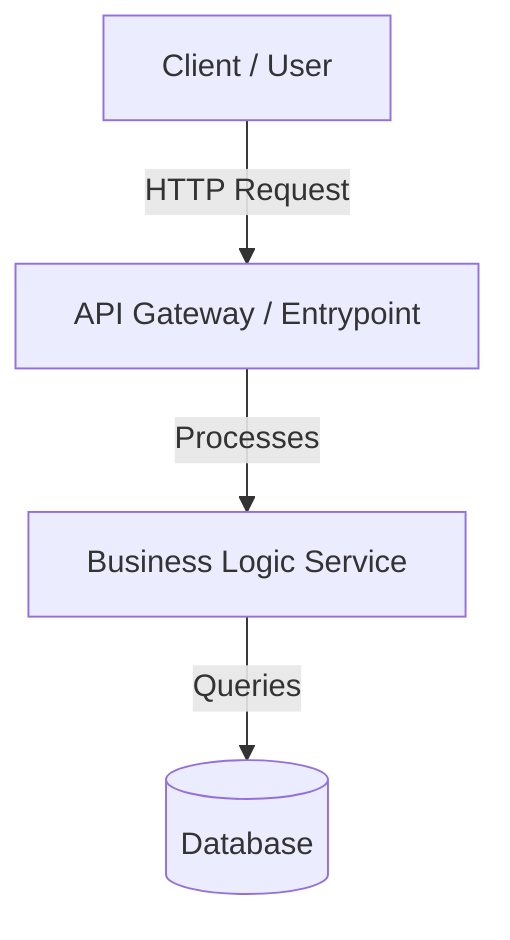

# 🚀 [App Name]

> [Short 1-sentence tagline describing the project]


```mermaid
flowchart TD
    Client[Client / User] -->|HTTP Request| API[API Gateway / Entrypoint]
    API -->|Processes| Service[Business Logic Service]
    Service -->|Queries| DB[(Database)]
```

## ⚡ Quick Start

```Bash
# Install dependencies
npm install

# Run locally
npm run dev
```